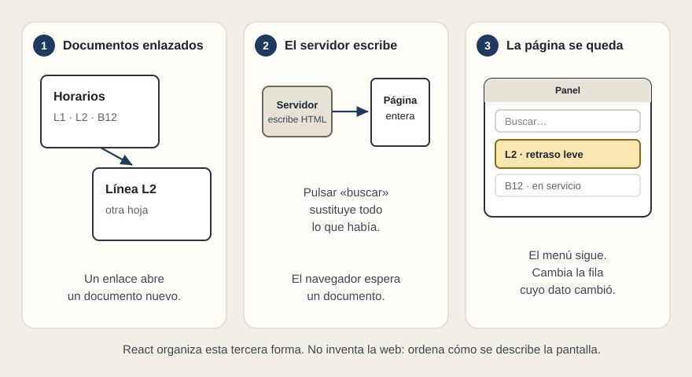

# La web en tres momentos

[← Página anterior](README.md) · [Siguiente página →](02-spa-y-tradicional.md)

Imagina que te enseñan tres productos y en los tres alguien dice «es una web». Los tres usan un navegador. El trabajo que hace el navegador no es el mismo.

## Documentos enlazados

Al principio la web es una carpeta de hojas. Cada dirección es un documento. Pulsas un enlace y llega otra hoja. Un horario, una ficha de línea, un aviso. El servidor guarda esas hojas, o las rellena con una plantilla, y el navegador las muestra. Si el contenido cambia poco, esta forma sigue siendo la correcta.

## El servidor escribe la siguiente hoja

Cuando la página depende de lo que acabas de pedir —una búsqueda, un filtro, un expediente— el servidor compone un documento nuevo en cada acción. El navegador tira la hoja anterior y pinta la nueva. Funciona, se entiende y se imprime. El coste es que toda la pantalla viaja y se sustituye, también el menú que no había cambiado.

## La página se queda

Hay trabajos en los que la persona permanece: un panel de líneas, una cola de alarmas, un detalle que se abre al lado de la lista. Pedir un documento entero en cada clic vuelve lenta la tarea y borra el contexto. La página se carga, y a partir de ahí viajan datos. Cambia la fila cuyo estado cambió. El marco alrededor sigue.

React nace para esa tercera forma. Ordena una idea que el navegador no trae puesta: **la pantalla se describe a partir de los datos, por piezas, y se vuelve a describir cuando los datos cambian.**

El resto del recorrido usa un panel de servicio pequeño —búsqueda, casilla «solo incidencias», líneas de metro y de bus— para que esa idea se pueda señalar con el dedo.

## Qué preguntar

- Cuando alguien dice «es una web», ¿cada acción trae un documento nuevo o la persona se queda en la misma vista?
- Lo que cambia a menudo, ¿es un párrafo editorial o un dato de operación?
- ¿El menú y el contexto tienen que sobrevivir al clic?
