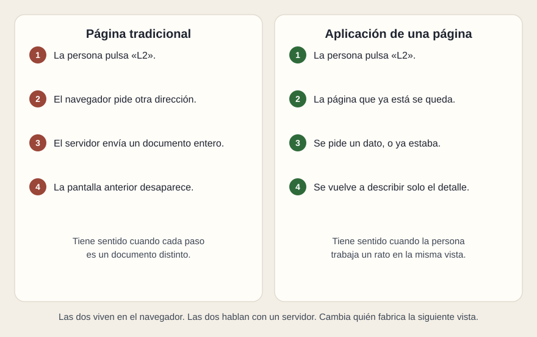

# La página que se queda

[← Página anterior](01-evolucion.md) · [Siguiente página →](03-que-es-react.md)

Una SPA (aplicación de una sola página) es esa tercera forma, con nombre. Se llama «de una sola página» porque el navegador carga un documento y, desde entonces, las vistas se cambian dentro de él. La dirección puede cambiar —`/lineas`, `/lineas/L2`— sin que llegue otro documento completo.

## Qué comparten

Las dos se abren en un navegador. Las dos acaban hablando con un servidor si el dato no viaja dentro de la página. Las dos pueden tener un menú, un listado y un detalle. Una persona que solo usa el panel no tiene por qué saber cuál de las dos está mirando, si están bien hechas.

## Qué cambia

En la página tradicional, el servidor es quien fabrica la siguiente vista. En la SPA, el navegador ya tiene el programa que fabrica la vista, y el servidor —cuando hace falta— entrega datos. Eso mueve trabajo al navegador de cada persona: la primera carga pesa más, porque baja el programa, y las siguientes interacciones pesan menos, porque baja un dato.

También mueve una responsabilidad. Si el programa del navegador calcula mal, todas las personas ven el mismo error a la vez, sin que el servidor haya escrito una página distinta. Por eso, más adelante, la revisión de un entregable mira la espera, el vacío y el error: son vistas que fabrica ese programa, y se olvidan con facilidad.

React es una forma de escribir ese programa. Una SPA puede existir sin React, y React puede usarse también en el servidor, dentro de un marco. «SPA» y «React» se nombran juntos en las propuestas. Son dos frases distintas.

## Qué preguntar

- ¿La primera carga trae ya el contenido, o un armazón que se rellena después?
- Si falla la red a mitad de la tarea, ¿qué queda en pantalla?
- ¿La dirección del detalle se puede guardar y enviar, o solo existe el clic?
