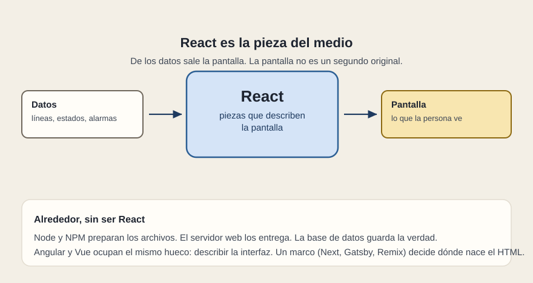

# Qué es React

[← Página anterior](02-spa-y-tradicional.md) · [Siguiente página →](04-cuando-tiene-sentido.md)

React es una biblioteca para describir una interfaz a partir de datos, partida en piezas. Una biblioteca: un conjunto de herramientas que un proyecto usa. El proyecto sigue necesitando un sitio donde vivir, unos datos de donde beber y, casi siempre, un marco que decida el resto.

## Por qué se usa

En un panel, la fila de L2 y la fila de B12 son el mismo problema con distintos datos. Si cada fila es un dibujo aparte, un cambio de redacción o de regla se persigue por todas las pantallas y se olvida en una. Con una pieza, el cambio vive en un sitio.

La segunda razón es el ritmo de los datos. Un estado de servicio cambia sin que la persona pida «otra página». Alguien tiene que decir: este letrero sale de este dato, y cuando el dato cambie, el letrero se vuelve a calcular. React es esa disciplina hecha herramienta. La disciplina se puede incumplir: cabe una sola pieza gigante que es la aplicación entera. La herramienta no sustituye el criterio.

## Qué queda fuera de React

La base de datos sigue siendo la fuente de la verdad operativa. El inicio de sesión de la empresa sigue siendo un sistema de identidad. El servidor web sigue entregando archivos, o un marco los prepara en cada visita. Android y Windows siguen siendo superficies distintas: React no las cubre solo por estar en el proyecto. Esas superficies tienen sus propias páginas más adelante (Ionic, React Native, Electron).

Cuando una propuesta dice «está hecho en React», la lectura útil es: la interfaz se va a describir por piezas que dependen de datos. Lo que falta por preguntar es dónde nace el HTML, de dónde sale el dato y en qué dispositivo está la persona.

## Qué preguntar

- ¿Puedo señalar la pieza que pinta una línea, separada de la lista que decide cuántas hay?
- Si el nombre de un estado cambia, ¿cuántos sitios hay que tocar?
- ¿React está nombrado junto con el servidor, la API y el dispositivo, o ocupa él solo el párrafo?
