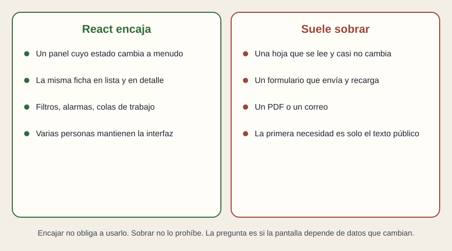

# Cuándo tiene sentido

[← Página anterior](03-que-es-react.md) · [Siguiente página →](05-alternativas-y-entorno.md)

React compensa cuando la pantalla es un trabajo, no un cartel. El cartel se publica y se lee. El trabajo se filtra, se actualiza y se abre en detalle mientras la persona sigue ahí.

## Dónde se ve con claridad

Un cuadro de mando con bloques que dependen de fuentes distintas. Una lista de alarmas que entra y sale. Un backoffice en el que la misma ficha aparece en una tabla y en un detalle. Un mapa operativo con un estado encima de cada elemento. En todos esos casos hay piezas repetidas y datos que cambian durante la visita.

## Dónde suele sobrar

Una página de campaña que se edita una vez al mes. Un PDF. Un formulario que se envía y muestra «gracias» recargando. Un informe que interesa impreso o indexado entero por un buscador, y que casi no tiene interacción. Ahí el documento sigue siendo la herramienta justa. Meter React añade un taller de construcción y una primera carga más pesada, a cambio de una interacción que nadie pidió.

## Ventajas que sí se pueden exigir

Las piezas se reutilizan, así que un significado tiene un sitio. La actualización es predecible: cambió el dato, se volvió a describir la pieza. Hay un ecosistema grande de marcos, de inspección y de pruebas, que más adelante sirven para auditar. Varias personas pueden repartirse la pantalla por piezas, si las piezas están de verdad separadas.

## Límites que conviene decir en la misma reunión

Hace falta un entorno de construcción antes de publicar. La primera vista puede llegar vacía si nadie prepara el HTML en el servidor: eso lo resuelve un marco, no React solo. Se puede escribir una interfaz imposible de mantener. Y React no elige el móvil ni el escritorio por ti.

Encajar no obliga. Sobrar no prohíbe. La frase que ordena la decisión es si **la pantalla depende de datos que cambian durante el uso**.

## Qué preguntar

- ¿Qué cambia mientras la persona está mirando, y cada cuánto?
- ¿Hay piezas que se repiten entre pantallas, o cada pantalla es un cartel distinto?
- ¿El coste del taller y de la primera carga está justificado por esa interacción?
