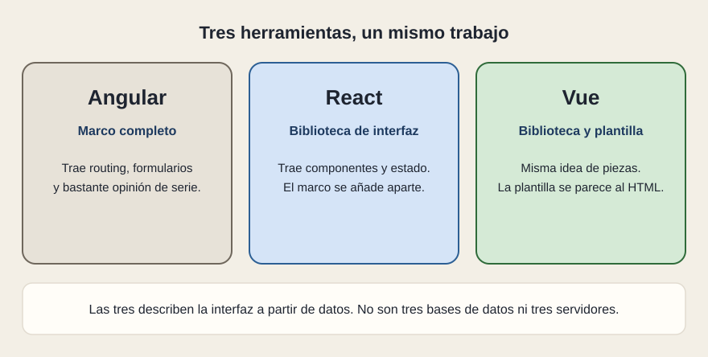
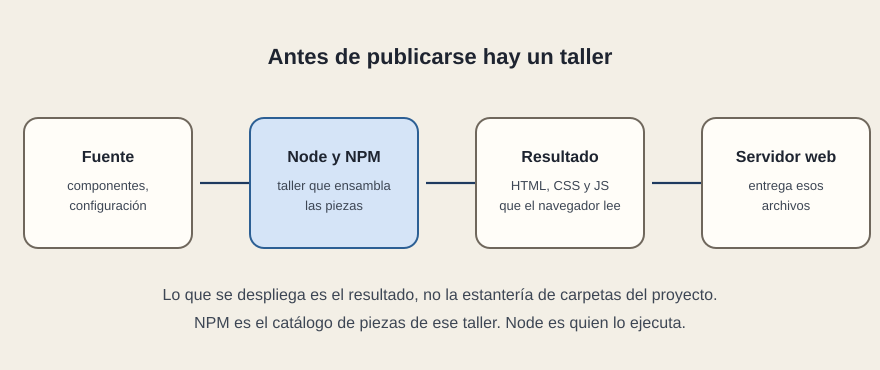

# Angular, Vue y el taller

[← Página anterior](04-cuando-tiene-sentido.md) · [Siguiente página →](../C02-pensar-en-la-interfaz/README.md)

En una propuesta aparecen nombres al lado de React. Unos ocupan su mismo hueco. Otros son el taller que hace falta para publicarlo.

## Tres maneras de describir la interfaz

Angular llega como marco: trae de serie el enrutado, los formularios y una manera bastante cerrada de organizar el proyecto. Quien lo elige acepta esa opinión. Se ve mucho en entornos que quieren un camino único para equipos grandes.

Vue parte de la misma idea que React —piezas que dependen de datos— y ofrece una plantilla más cercana al HTML de siempre. Para quien lee una pantalla, el resultado puede ser indistinguible. La diferencia está en cómo el equipo describe la pieza y en qué trae puesto el proyecto.

React trae la idea de piezas y de estado, y deja el resto abierto. Por eso detrás suele venir un marco (Next.js es el que más verás) o un empaquetador para una SPA. Esa apertura es la ventaja y el riesgo: dos proyectos «en React» pueden estar organizados de formas muy distintas. De ahí que la revisión mire la estructura, no solo el nombre.

Ninguno de los tres es una base de datos ni un servidor de negocio. Si la propuesta los trata como si lo fueran, el párrafo está mezclando capas.

## Node y NPM

El navegador no abre la estantería de carpetas del proyecto. Abre HTML, CSS y JavaScript ya preparados. Entre las dos cosas hay un taller.

Node ejecuta ese taller en la máquina de quien construye, y a veces también en el servidor si el marco fabrica páginas en cada visita. NPM es el catálogo del que salen las piezas de terceros, React incluido, con versiones fijadas. Sin ese paso, React no se «sube» a un servidor web como se sube un HTML escrito a mano.

En una entrega, lo que se publica es el resultado del taller. Pedir el resultado y pedir también la fuente son dos cosas: la fuente se revisa, el resultado es lo que corre.

## Qué preguntar

- ¿Angular, Vue o React están elegidos por el tipo de interfaz, o solo porque el equipo ya lo conoce? Las dos respuestas valen; conviene oírlas.
- ¿Dónde está el marco, si React va solo en el nombre?
- ¿La entrega incluye el resultado construido y la forma de volver a construirlo?
