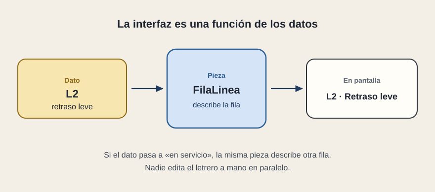

# La pantalla sigue al dato

[← Página anterior](README.md) · [Siguiente página →](02-el-boceto.md)

React se apoya en una frase: **la interfaz es una función de los datos**. Entras un dato, sale un trozo de pantalla. Si el dato cambia, sale otro trozo. No hay un letrero paralelo que alguien actualice a mano.

## Qué cambia en la pregunta

Delante de una caja, la pregunta deja de ser «¿cómo está maquetada?» y pasa a ser «¿de qué dato sale, y quién lo modifica?». Si nadie responde, la pantalla y la operación se desincronizan: la persona ve un estado y el sistema tiene otro.

Una **componente** —aquí la llamaremos pieza— es la unidad de esa función. `FilaLinea` sabe describir un nombre y un estado. No sabe cuántas líneas hay. Quien la usa se lo dice, una vez por línea. Dos filas no son dos diseños: son la misma función con datos distintos.

## Qué se gana al creerlo

El listado y el detalle pueden compartir la regla visual del estado. Si «retraso leve» pasa a llamarse «demora», el cambio vive en el dato o en la pieza, no en diez pantallas copiadas. Eso es lo que una propuesta quiere decir, cuando es seria, con «componentes reutilizables»: un cambio de significado no se persigue a mano.

La frase también pone un límite. Lo que la pieza no recibe, no puede mostrarlo. Si el detalle enseña un teléfono de guardia y ese teléfono no está en los datos, o está escrito a fuego dentro de la pieza, hay una segunda fuente de verdad. Conviene verla antes de dar por buena la pantalla.

## Qué preguntar

- ¿El texto que veo sale de un dato o está clavado en la pieza?
- Si el dato de L2 cambia en origen, ¿qué caja tiene que cambiar con él?
- ¿Hay algún letrero que se actualice por otro camino?
