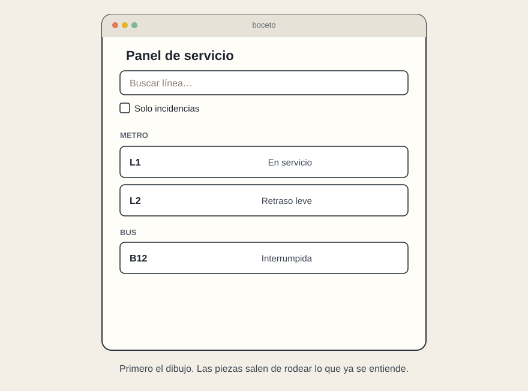
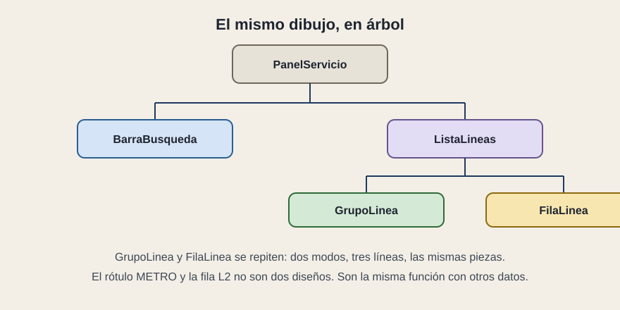

# Empieza por el boceto

[← Página anterior](01-la-pantalla-sigue-al-dato.md) · [Siguiente página →](03-props-y-estado.md)

Imagina que ya tienes un dibujo y unos datos. Los datos, en JSON, se parecen a esto:

```text
{ "nombre": "L1", "modo": "Metro", "estado": "En servicio" }
{ "nombre": "L2", "modo": "Metro", "estado": "Retraso leve" }
{ "nombre": "B12", "modo": "Bus", "estado": "Interrumpida" }
```

El dibujo se parece a esto:



Para leer una interfaz hecha con React se siguen los mismos pasos, aunque no vayas a escribirla. El primero es rodear el boceto.

## Paso 1. Separa el dibujo en piezas

Dibuja una caja alrededor de cada cosa que tenga un solo trabajo, y ponle nombre. Si el diseño ya trae nombres, usa esos.


Hay cinco piezas:

1. `PanelServicio` contiene la pantalla.
2. `BarraBusqueda` recibe lo que la persona escribe y la casilla.
3. `ListaLineas` muestra el conjunto, ya filtrado.
4. `GrupoLinea` es el rótulo «Metro» o «Bus». Se repite.
5. `FilaLinea` es una línea con su estado. Se repite.

El título «Panel de servicio» se queda dentro de `PanelServicio`. Podría ser una pieza propia si un día lleva logo, reloj y avisos. Mientras sea una frase, partirlo no aporta. El criterio es el de siempre: si una caja empieza a hacer dos trabajos, se parte.

Si el JSON está bien formado, las piezas se parecen a los datos. Hay modos y, dentro, líneas. Por eso existen `GrupoLinea` y `FilaLinea`, y no una caja distinta para L1.

## Paso 2. Ordénalas en un árbol



- `PanelServicio`
  - `BarraBusqueda`
  - `ListaLineas`
    - `GrupoLinea`
    - `FilaLinea`

Ese árbol es la arquitectura de la pantalla, antes de que exista una carpeta. Cuando veas un proyecto, busca si las carpetas se parecen a este árbol o si todo vive en un solo sitio.

## Qué preguntar

- ¿Cada caja del boceto tiene un nombre y un solo trabajo?
- ¿Las filas repetidas son la misma pieza?
- ¿El árbol cabe en un minuto de explicación?
