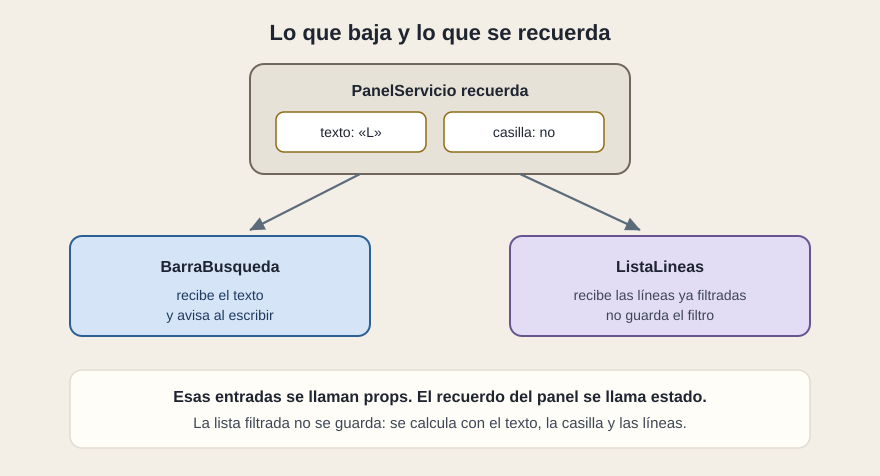

# Props y estado

[← Página anterior](02-el-boceto.md) · [Siguiente página →](04-cuando-cambia-un-dato.md)

Con el árbol delante, el siguiente paso es imaginar la pantalla **quieta**: los datos entran y las piezas describen filas. Todavía no hay interacción. En esa versión, todo lo que una pieza sabe le llega desde fuera. Esas entradas se llaman **props**.

La interacción aparece cuando la persona escribe o marca la casilla. Algo tiene que recordarlo. Ese recuerdo, mientras la pieza está en pantalla, se llama **estado**.

## Paso 3. Quédate con el mínimo que cambia

Haz la lista de todo lo que la pantalla maneja:

1. Las líneas que vinieron de los datos.
2. El texto que la persona ha escrito.
3. La casilla «solo incidencias».
4. La lista ya filtrada que se está viendo.

Ahora tacha lo que no hace falta recordar:

- Las líneas originales llegan desde fuera. Son props del panel, no un recuerdo suyo.
- El texto cambia con el tiempo y no se puede calcular a partir de otra cosa. Es estado.
- La casilla, igual. Es estado.
- La lista filtrada se obtiene de las otras tres. Calcularla otra vez es más seguro que guardarla: un recuerdo de más acaba desfasado.

Lo que queda es el estado: el conjunto mínimo de datos cambiantes. El resto se deriva.

## Hacia abajo, y de vuelta

Las props bajan. `BarraBusqueda` recibe el texto actual y una forma de avisar cuando la persona escribe. `ListaLineas` recibe las líneas ya filtradas. `FilaLinea` recibe un nombre y un estado. Ninguna de ellas guarda el filtro.

Cuando la persona pulsa una fila, el aviso sube hasta la pieza que puede hacer algo con él. La fila no abre el detalle por su cuenta si el detalle es un asunto del panel. Dice «han pulsado L2» y quien recuerda la selección decide.

El estado vive en la memoria de esa visita. Al recargar, se vuelve a crear. La base de datos, si existe, está detrás de una API. Lo que no se haya puesto en la dirección o en el servidor no continúa.

## Qué preguntar

- ¿Qué recuerda esta pantalla, y qué está solo calculado?
- ¿Hay un contador guardado que podría salir de la longitud de la lista?
- Si recargas, ¿qué desaparece, y es eso lo que el negocio espera?
