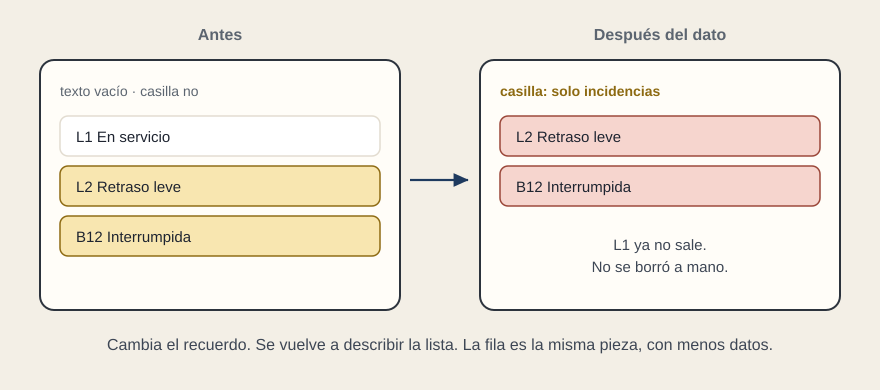
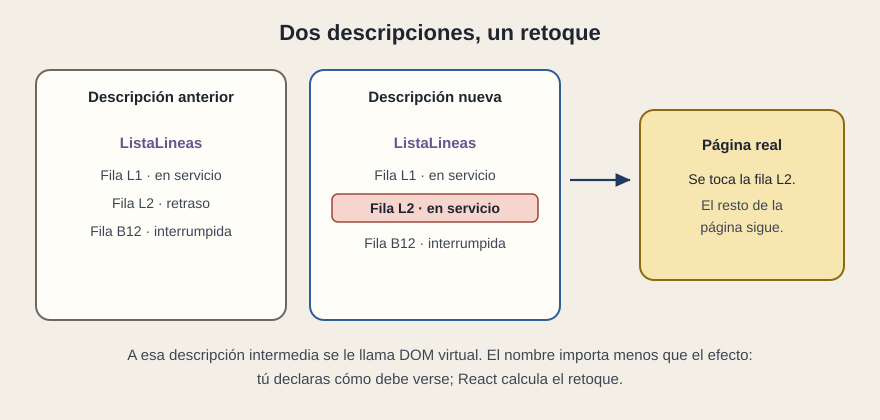

# Cuando cambia un dato

[← Página anterior](03-props-y-estado.md) · [Siguiente página →](05-lectura-guiada.md)

Marcas «solo incidencias». El recuerdo del panel cambia. React vuelve a pedir la descripción de la lista. L1 iba «en servicio», así que deja de salir. Nadie ha borrado una fila del documento a mano.

## Describir el resultado

La persona que diseña la pieza describe cómo debe verse la lista con los datos de ahora. No describe los pasos «quita L1, deja L2, deja B12». Esa diferencia importa en una revisión: si el equipo habla de retoques sueltos sobre la página («añade un nodo», «cambia este texto del HTML»), el proyecto va por otro camino. Si habla de «con estos datos, la lista es esta», va por el de React.

## El DOM virtual, en una frase

El navegador tiene una página real. React guarda una descripción de cómo debería ser y, cuando el dato cambia, construye la descripción nueva. Compara las dos y aplica en la página real solo el retoque necesario.

A la descripción intermedia se le llama DOM virtual. El nombre aparece en propuestas y en entrevistas. El efecto que tienes que poder explicar es este: se declara el resultado, y el retoque de la página real sale de comparar. Por eso cambiar un estado no obliga a reconstruir el documento entero, que era el coste de la página tradicional.

La comparación no es magia gratis. Una lista de miles de filas, descrita de nuevo sin cuidado, sigue pudiendo ir lenta. El rendimiento, más adelante, mira precisamente eso: si un cambio pequeño retoca una caja pequeña.

## Qué preguntar

- Cuando un dato cambia, ¿qué caja se vuelve a describir?
- ¿El equipo habla del resultado («la lista con este filtro») o de parches sobre la página?
- ¿Un cambio de una fila obliga a repintar paneles que no dependían de ella?
