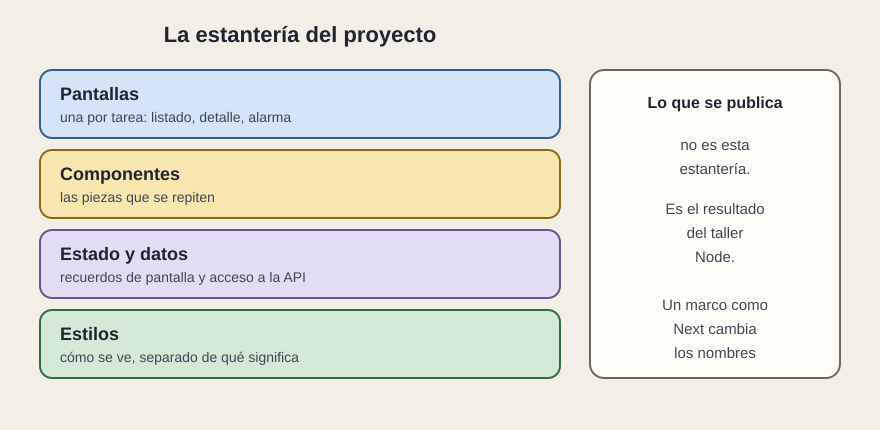

# La estantería

[← Página anterior](README.md) · [Siguiente página →](02-quien-decide.md)

Un proyecto React, mirado de lejos, tiene cuatro plantas. Los nombres de las carpetas cambian de un equipo a otro. Las plantas, si el proyecto está ordenado, se reconocen.

## Qué hay en cada planta

**Pantallas.** Una por tarea grande: el listado, el detalle, el muro de alarmas. En una SPA suelen ser vistas que el programa cambia. En un marco como Next.js suelen ser carpetas de rutas: la dirección de la barra del navegador y la pantalla van juntas. El concepto es el mismo.

**Componentes.** Las piezas repetibles del boceto: `FilaLinea`, `BarraBusqueda`, un aviso, un botón con el estilo de la casa. Viven aparte de las pantallas para que dos pantallas puedan usarlas sin copiarlas.

**Estado y datos.** El recuerdo de la pantalla y el sitio por donde se pide a la API. Cuando esto se mezcla con el dibujo de la fila, la estantería se ha caído en un solo cajón.

**Estilos.** El color, el espacio, el tipo de letra. Separados del significado. «Retraso leve» es un dato. El ámbar con el que se pinta es un estilo. Si el color es la única forma de leer el estado, eso se revisa en accesibilidad, no aquí.

## Lo que se publica

La estantería es la fuente. El navegador recibe el resultado del taller del que hablaba el módulo del ecosistema. En una revisión, pedir «la carpeta del proyecto» y pedir «lo que está desplegado» son dos entregas. Las dos importan: la primera se lee, la segunda es la que usa la persona.

Un proyecto pequeño puede vivir en menos carpetas. La señal sana no es el número de niveles. Es poder decir en qué planta está la regla del filtro y en cuál está el dibujo de la fila.

## Qué preguntar

- ¿Las pantallas y las piezas repetidas están separadas?
- ¿La llamada a la API tiene un sitio, o aparece dentro de cada dibujo?
- ¿Lo desplegado es el resultado de un taller repetible?
