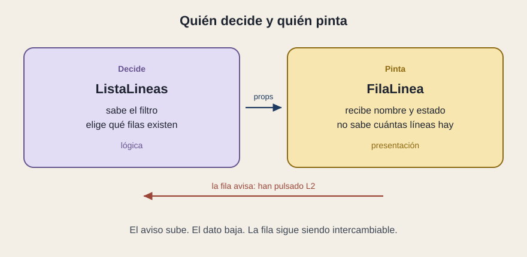

# Quién decide y quién pinta

[← Página anterior](01-la-estanteria.md) · [Siguiente página →](03-donde-vive-el-recuerdo.md)

En el panel hay dos oficios. Uno elige qué filas existen. El otro dibuja una fila cuando le dan un nombre y un estado. Confundirlos es la forma más común de que una pieza deje de poder reutilizarse.

## Presentación

La pieza de presentación recibe props y describe pantalla. `FilaLinea` es el ejemplo limpio. Se puede colocar en el listado, en un resultado de búsqueda o en un correo interno de resumen, siempre que alguien le pase el nombre y el estado. No sabe de casillas ni de direcciones web.

## Lógica

La pieza lógica decide. Conoce el filtro, elige la lista, pide datos, interpreta un error. `ListaLineas`, en la versión simple, hace una parte de eso. `PanelServicio` hace el resto: guarda el texto y la casilla.

A este reparto se le ha llamado patrón contenedor y presentación. El contenedor decide y pasa props. La presentación pinta y, si acaso, avisa de un clic. Hoy muchos equipos escriben las dos cosas en la misma pieza cuando es pequeña, y las separan cuando duele. El nombre del patrón importa menos que el síntoma: si la fila conoce la API, el reparto se ha roto.

## Por qué el aviso sube

El clic nace en la fila, que es donde está el dedo. La decisión nace más arriba, que es donde está el recuerdo. La fila dice «han pulsado L2». El panel guarda qué línea está elegida y describe el detalle. Si la fila abriera el detalle por dentro, conocería la navegación y dejaría de servir en un sitio donde el clic hace otra cosa, por ejemplo seleccionar para una exportación.

## Qué preguntar

- ¿La pieza que pinta una fila sabe de servidores, rutas o permisos?
- ¿El clic sube hasta quien recuerda, o cada pieza resuelve su propio destino?
- Si mañana la misma fila se usa en otra pantalla, ¿hay que copiarla o basta con pasarle otros datos?
