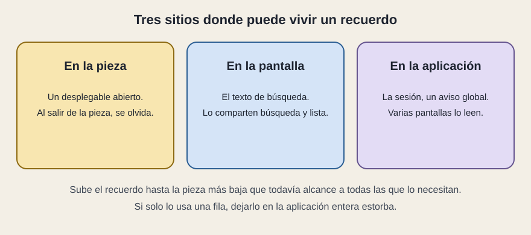

# Dónde vive el recuerdo

[← Página anterior](02-quien-decide.md) · [Siguiente página →](04-patrones-y-visita.md)

El estado es un recuerdo. La decisión de arquitectura es dónde sentarlo. Hay tres sillas, y sentarlo en la más alta «por si acaso» suele estorbar.

## En la pieza

Un desplegable abierto, el texto a medias de un campo que nadie más lee, una pestaña interior de una ficha. Muere cuando la pieza se va, y eso es lo correcto. Nadie espera que el desplegable siga abierto después de cambiar de pantalla.

## En la pantalla

El texto de búsqueda y la casilla. Los usan la barra y la lista, así que viven en el panel, que es la pieza más baja que todavía los alcanza a los dos. Bajarlos a la fila sería imposible: la fila no ve a sus hermanas. Subirlos a toda la aplicación haría que otra pantalla, al montarse, heredara un filtro que no le pertenece.

## En la aplicación

La sesión de la persona, el idioma, un aviso que debe verse desde cualquier pantalla, unos datos que varias pantallas leen y que no quieres pedir cinco veces. Ahí el recuerdo se sienta fuera de una sola vista. A veces en un contexto de React, a veces en una biblioteca de estado global. Para leer una propuesta basta el criterio: **varias pantallas lo necesitan durante la misma visita**.

La dirección del navegador es otro sitio, fácil de olvidar. Si la línea elegida está solo en memoria, no se puede enviar el enlace del detalle. Si está en la dirección, recargar y compartir funcionan. Parte del «estado» de una aplicación bien hecha es la URL.

## Qué preguntar

- ¿Este recuerdo lo lee una pieza, una pantalla o varias?
- ¿Hay estado global para datos que solo usa una vista?
- Lo que la persona querría enlazar, ¿está en la dirección o solo en memoria?
