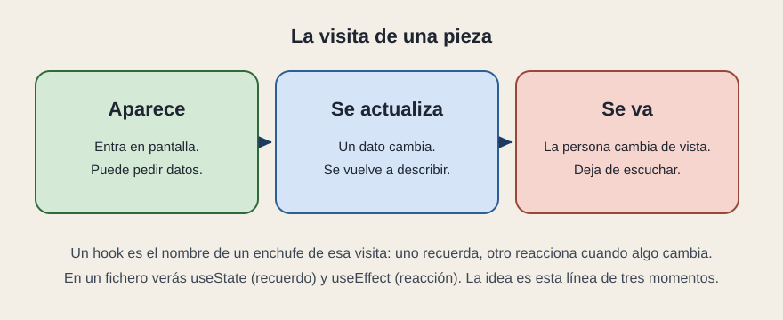

# Patrones y la visita

[← Página anterior](03-donde-vive-el-recuerdo.md) · [Siguiente página →](../C04-sistemas/README.md)

Tres nombres aparecen en cuanto un equipo explica su código: contenedor, hooks y ciclo de vida. Los tres describen la visita de una pieza, no un segundo producto.

## Contenedor y presentación

Es el reparto de la página anterior, con el nombre que verás en documentos viejos y nuevos. Contenedor: decide y recuerda. Presentación: pinta. En el panel, `PanelServicio` tiende a ser contenedor y `FilaLinea` es presentación. No hace falta que cada pieza lleve una de las dos etiquetas. Hace falta que, si preguntas «¿quién decide el filtro?», la respuesta sea una pieza y no «un poco todas».

## Hooks

Un hook es un enchufe. `useState` enchufa un recuerdo: el texto, la casilla. `useEffect` enchufa una reacción: cuando la pieza aparece, o cuando cambia una prop, haz esto —pide las líneas, suscríbete a las alarmas—. Al irse la pieza, esa reacción se deshace: se deja de escuchar.

Verás más nombres (`useMemo`, `useContext`, y otros que el equipo se fabrique). La lectura de negocio se queda en dos preguntas: ¿esto recuerda o esto reacciona? ¿La reacción se apaga cuando la pieza se va?

## Ciclo de vida

Aunque la palabra suena a maquinaria, es una visita:

1. **Aparece.** La pieza entra en pantalla. Es el momento de pedir lo que aún no tiene o de abrir una escucha.
2. **Se actualiza.** Un dato o una prop cambian. Se vuelve a describir. Es el camino normal, no una excepción.
3. **Se va.** La persona navega a otra vista, o un filtro quita la fila. Hay que soltar la escucha. Una alarma que sigue llegando a una pieza que ya no está es una fuga: trabajo gastado y, a veces, un error.

Los textos antiguos de React hablan de «montar, actualizar, desmontar». Es esta misma visita, con otros verbos.

## Qué preguntar

- ¿Quién decide y quién pinta, con nombre de pieza?
- Los enchufes que reaccionan al aparecer, ¿se sueltan al irse?
- ¿El equipo puede contar la visita de la pieza de alarma en esas tres frases?
