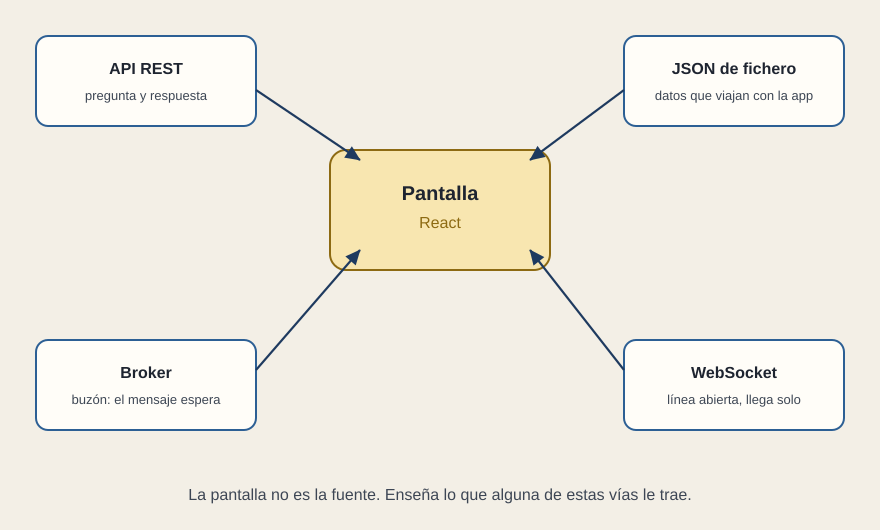

# De dónde sale el dato

[← Página anterior](README.md) · [Siguiente página →](02-la-espera.md)

La pantalla enseña. La fuente guarda o emite. Entre las dos hay un acuerdo sobre la forma del dato. Ese acuerdo, muy a menudo, se escribe en JSON: un texto con nombres y valores, el mismo que veías en el boceto (`nombre`, `modo`, `estado`).

## API REST

La pantalla pregunta y el servidor responde. «Dame las líneas.» «Dame L2.» «Anota que esta incidencia está vista.» Cada pregunta tiene una dirección y un verbo. La respuesta trae un JSON, o un código de que algo fue mal. Es el contrato más fácil de señalar en una reunión: se puede escribir en una página y las dos partes lo firman con la mirada.

REST no es «el backend». Es una manera de hablar con él. El backend puede ser varios servicios detrás de esa puerta.

## Fichero JSON

A veces los datos viajan dentro de la propia aplicación: un catálogo que cambia cuando se publica una versión nueva, no en cada visita. Sirve para demos, para configuración y para contenido estable. Si el estado operativo de L2 estuviera en un fichero empaquetado, la pantalla mentiría hasta la próxima publicación.

## Broker

Un broker es un buzón entre sistemas. Una fuente deja un mensaje («L2 ha pasado a retraso») y quien esté suscrito lo recoge. La pantalla no llama a la fuente. Esto aparece cuando hay muchos productores y muchos consumidores, y cuando el mensaje debe sobrevivir aunque el consumidor esté ocupado. React, en ese dibujo, está al final: alguien del lado servidor traduce el mensaje a algo que la pantalla pueda pedir o recibir.

## WebSocket

Una línea que se queda abierta. El servidor puede hablar sin esperar a que la pantalla pregunte. Es el ajuste natural de una alarma o de un panel que no puede ir a rascar la API cada segundo. El concepto basta: hay una conversación continua, y al irse la pieza hay que colgar.

Las cuatro vías pueden convivir. El catálogo de líneas en un JSON de publicación, el estado por REST al entrar, y el cambio siguiente por WebSocket. Lo que no puede convivir en paz son dos verdades distintas para el mismo estado.

## Qué preguntar

- ¿Cuál es la fuente de cada caja del panel?
- ¿El contrato del JSON está escrito en algún sitio que las dos partes reconozcan?
- Lo que llega solo, ¿llega por una línea abierta o la pantalla está preguntando sin parar?
