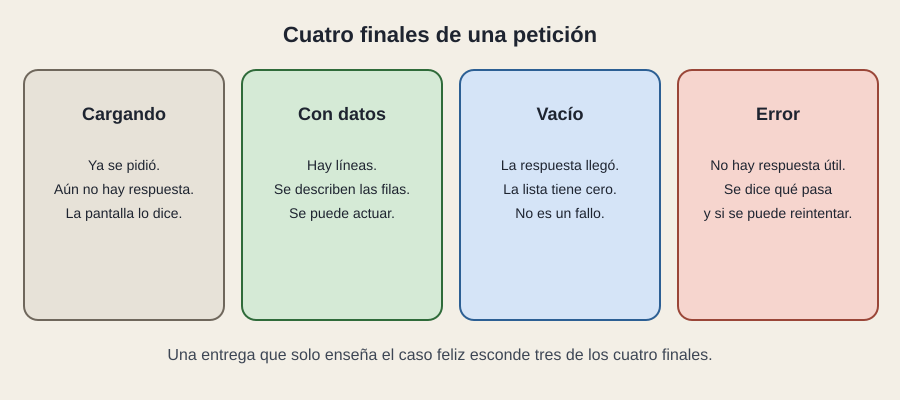

# La espera

[← Página anterior](01-de-donde-sale-el-dato.md) · [Siguiente página →](03-pantallas-tipicas.md)

Pedir un dato lleva tiempo. Entre el clic y la respuesta la pantalla sigue ahí, porque es una SPA. Alguien tiene que decidir qué se ve en ese intervalo, y también qué se ve si la respuesta llega vacía o rota.

## Cargando

La pregunta ya salió. Aún no hay respuesta. Un panel en blanco parece roto. Un texto o un esqueleto de filas dice «sigue en curso». Si la pregunta tarda siempre, el problema ya no es el dibujo: es el contrato o la red. El dibujo, al menos, no miente.

## Con datos

El caso que todo el mundo enseña en la demo. Las piezas reciben props y describen filas. Aquí se comprueba el boceto: ¿la fila es una, repetida, o cada línea es un dibujo especial?

## Vacío

La respuesta llegó y la lista tiene cero elementos. Puede ser verdad: no hay incidencias, el filtro no encuentra, esa cochera no tiene vehículos. Vacío es un resultado, con su frase. Tratarlo como error empuja a la persona a reintentar algo que ya funcionó.

## Error

No hay respuesta útil. La red se cayó, la identidad expiró, el servidor rechazó la pregunta. La pantalla dice qué ha pasado en lenguaje de la tarea y, cuando tiene sentido, ofrece reintentar. Un código técnico solo, o un panel que se queda cargando para siempre, es el mismo fallo de diseño: la espera no tiene final.

Estos cuatro estados son estado de la interfaz, en el sentido del módulo anterior. «Estamos cargando» se recuerda o se deriva de la petición. No es un dato de negocio. Mezclarlo con el estado operativo de L2 confunde la revisión: uno habla de la conversación con el servidor, el otro habla del servicio.

Refrescar es la misma máquina otra vez. Un botón «actualizar», un temporizador o un mensaje que llega por la línea abierta vuelven a poner la pantalla en cargando —o en una actualización discreta— y otra vez en uno de los cuatro finales.

## Qué preguntar

- ¿Me pueden enseñar el vacío y el error, además de la demo con datos?
- ¿El vacío dice algo distinto del error?
- Mientras carga, ¿se puede pulsar dos veces y disparar dos peticiones?
