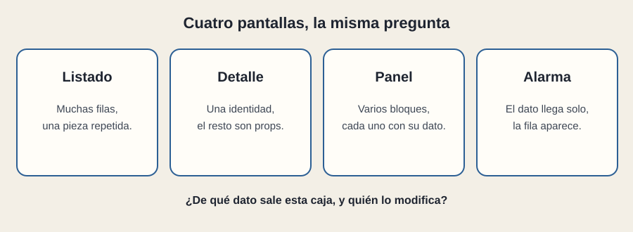

# Cuatro pantallas

[← Página anterior](02-la-espera.md) · [Siguiente página →](04-en-la-empresa.md)

Dashboards, alarmas, listados y fichas de detalle parecen cuatro productos. Delante de React son cuatro bocetos, y la pregunta no cambia: de qué dato sale esta caja, y quién lo modifica.

## Listado

Muchas filas, una pieza. El estado que importa es el filtro y, a veces, la página de resultados. El riesgo es la copia: cada columna con su regla escondida, o un botón que solo existe en la primera fila porque se dibujó a mano.

## Detalle

Una identidad. Casi todo son props que bajan de esa identidad: nombre, estado, último cambio, a quién avisar. El riesgo es el dato que solo vive en esta pantalla y contradice al listado. Si el listado dice «retraso leve» y el detalle dice «parada técnica», hay dos fuentes, o un contrato ambiguo.

## Panel

Varios bloques en la misma visita: un resumen, una lista, un aviso. Cada bloque tiene su dato y, a menudo, su espera. Uno puede estar en error mientras otro ya tiene datos. Un panel que se queda entero en blanco porque falló una de cuatro fuentes está atando vidas que el negocio no había atado.

## Alarma

El dato llega solo. No siempre hay un «cargando» inicial después de la primera conexión: hay silencio, que puede ser vacío verdadero o una línea caída. Conviene que la pantalla distinga «no hay alarmas» de «hace rato que no llega nada». La pieza aparece cuando llega el mensaje y se va cuando la alarma se cierra o se archiva. Esa es su visita.

En los cuatro casos, la integración se lee igual en la propuesta: fuente, contrato, pieza, espera.

## Qué preguntar

- ¿Cada bloque del panel tiene su propia espera?
- ¿El detalle y el listado leen el mismo contrato?
- En la alarma, ¿cómo se distingue el silencio sano de la línea caída?
