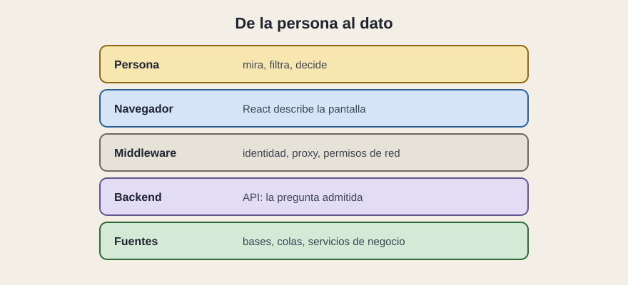

# En la empresa

[← Página anterior](03-pantallas-tipicas.md) · [Siguiente página →](../C05-calidad/README.md)

React ocupa una capa. Encima está la persona. Debajo están la red de la casa, el backend y las fuentes. Una propuesta que solo nombra React deja las otras capas al azar, y el azar en una red corporativa suele llamarse «en mi portátil funcionaba».

## La persona y el navegador

La persona ve piezas. El navegador ejecuta el resultado del taller, guarda el recuerdo de la visita y habla hacia fuera solo por lo que la red deja. Todo secreto que viaje dentro de ese resultado —una clave, una contraseña de servicio— queda en la máquina de la persona. Los secretos viven debajo, en el servidor.

## Middleware

Entre el navegador y la API hay identidad, proxy, cortafuegos y, a veces, una puerta que agrega varios servicios para que la pantalla haga una sola pregunta. El inicio de sesión de la empresa no lo inventa React: React recibe una sesión ya hecha y la enseña, o la pierde y muestra el error de «tu sesión ha caducado».

También aquí se decide el entorno. La misma pantalla apunta a una API de pruebas o a la de producción según dónde se construyó o según la configuración del sitio. Si esa diferencia no está escrita, una demo puede estar enseñando datos que no son los del sistema real.

## Backend y fuentes

El backend es quien admite la pregunta. Las fuentes —bases, colas, sistemas de negocio— no tienen por qué ser visibles para la pantalla. Cuando lo son, el navegador acaba conociendo demasiados sistemas y cada cambio interno rompe la interfaz.

El acuerdo estable es el contrato: direcciones, JSON, errores previstos. Cambiar el color de una fila es un cambio de pieza. Cambiar el nombre de un campo del JSON es un cambio de acuerdo entre equipos. El segundo necesita dueño.

React no sustituye ese acuerdo. Lo consume en cada visita, y lo vuelve visible en cuanto la espera, el vacío y el error están diseñados.

## Qué preguntar

- ¿Dónde acaba la sesión de la persona, y qué ve cuando caduca?
- ¿Qué dirección de API usa la demo, y es la del entorno que creemos?
- ¿Quién firma el JSON: el equipo de la pantalla, el del backend, o nadie?
