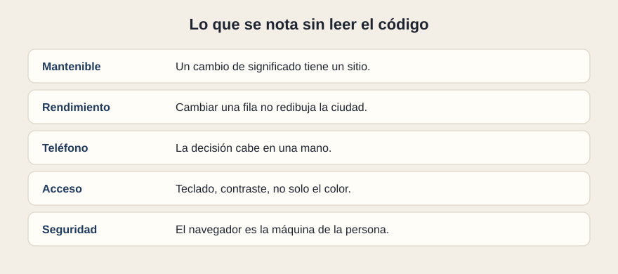

# Lo que se nota

[← Página anterior](README.md) · [Siguiente página →](02-como-se-comprueba.md)

Cinco cualidades se pueden mirar con el producto delante, antes de abrir un fichero. Si fallan, el código casi seguro las confirma. Si se sostienen, el código todavía puede estar frágil: por eso la página siguiente pide pruebas y una radiografía.

## Mantenible

Un cambio de significado tiene un sitio. «En servicio» pasa a «operativa» y se toca el dato o la pieza, no diez pantallas. Las responsabilidades que viste —quién decide, quién pinta— se pueden nombrar. Esa es la buena práctica que de verdad importa: el resto (nombres de carpetas, formato, moda del año) está a su servicio.

## Rendimiento

Cambiar una fila no redibuja la ciudad. La lista no pide al servidor en cada tecla si con una pregunta bastaba. Las imágenes pesan lo que tienen que pesar. Un panel con cientos de alarmas sigue pudiendo desplazarse. Cuando no, el síntoma se ve: la interacción va a tirones justo al filtrar o al llegar un dato. La causa suele estar en describir de nuevo demasiado, o en pedir demasiado.

## Teléfono y otros tamaños

La misma información, otro marco. En el teléfono la tabla ancha se convierte en fichas, el filtro baja a un control alcanzable, el detalle ocupa la visita en vez de ir al lado. Responsivo quiere decir que la decisión de negocio sigue pudiendo tomarse, no que el escritorio se haya encogido hasta lo ilegible. Conviene mirarlo en un ancho estrecho de verdad, no solo «un poco más pequeño que mi monitor».

## Acceso

El estado no vive solo en el color: «retraso» se lee también en la palabra. Se puede llegar a la búsqueda, a la casilla y a la fila con el teclado. El foco se ve. Los contrastes aguantan luz de oficina y luz de calle. Un botón que solo es un icono tiene un nombre que una tecnología de apoyo puede leer. Accesibilidad, en este curso, es esa lista corta. Si falla, falla para más gente de la que el equipo suele contar, y a veces falla también el uso ordinario.

## Seguridad básica

El navegador es la máquina de la persona. Lo que el taller mete en el resultado se puede mirar. Las claves de servicio y los secretos de API viven en el servidor. La sesión se puede caducar, y la pantalla lo enseña. Los textos que vienen de fuera se muestran como texto, no como órdenes. Con eso basta para una revisión de perfil de negocio: si un secreto está en el frontal, el entregable no está listo, aunque la demo impresione.

## Qué preguntar

- ¿Un cambio de redacción tiene un sitio identificable?
- ¿La tarea se puede completar en el teléfono y con teclado?
- ¿Hay algún secreto dentro de lo que el navegador descarga?
