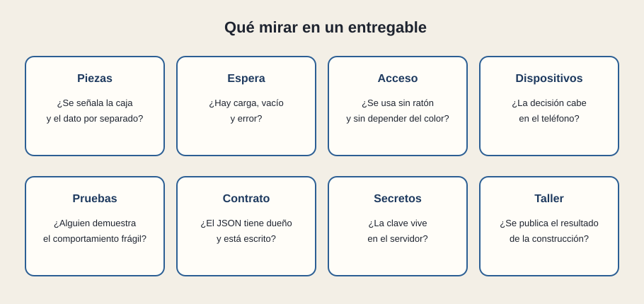

# Qué validar en un entregable

[← Página anterior](02-como-se-comprueba.md) · [Siguiente página →](04-senales-de-alerta.md)

Esta lista se puede llevar a una reunión. Cada casilla es una pregunta, no un trámite. Si la respuesta es un silencio, ese silencio es el hallazgo.

## Piezas

¿Se puede señalar la caja del boceto y el dato del que sale, por separado? ¿Las filas repetidas son una pieza?

## Espera

¿Hay carga, vacío y error, enseñados, no solo prometidos? ¿El vacío dice otra cosa que el error?

## Acceso

¿Se recorre con teclado? ¿El estado se lee sin depender del color? ¿Los iconos tienen nombre?

## Dispositivos

¿La decisión cabe en el teléfono? ¿En el ancho estrecho sigue habiendo filtro, lista y detalle, aunque sea en visitas separadas?

## Pruebas

¿Alguien demuestra el comportamiento frágil con una prueba o con un guion repetible? ¿Se puede volver a ejecutar?

## Contrato

¿El JSON tiene dueño? ¿Los campos que la pantalla usa están escritos en un sitio común con el backend?

## Secretos

¿Las claves viven en el servidor? ¿La sesión caducada tiene una pantalla?

## Taller

¿Se publica el resultado de la construcción, y se sabe cómo repetirla? ¿El entorno de la demo es el que creemos?

Ocho «sí» no convierten un proyecto en sano para siempre. Ocho silencios sí dicen que la demo está enseñando el caso feliz y nada más. Para un perfil que valida, el segundo mensaje es el útil.

## Qué preguntar

- ¿Cuál de las ocho no se puede responder hoy?
- ¿La demo enseña el error con la misma calma que los datos?
- ¿Dentro de un mes, otra persona podría repetir la construcción?
