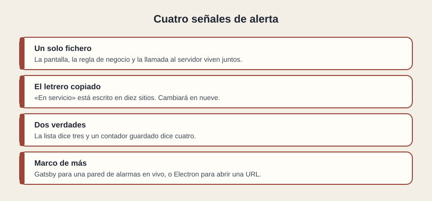

# Señales de alerta

[← Página anterior](03-que-validar.md) · [Siguiente página →](../C06-marcos/README.md)

Hay olores que se reconocen sin medir nada. No prueban que el proyecto vaya a fallar mañana. Prueban que el coste de cambiarlo va a ser alto, o que la tecnología elegida no responde al problema.

## Un solo fichero

La pantalla, la regla de negocio y la llamada al servidor viven juntos. Nadie puede cambiar el dibujo sin arriesgar la regla. Es el síntoma de una arquitectura poco clara y, con el tiempo, de un proyecto que solo entiende quien lo escribió.

## El letrero copiado

«En servicio» está escrito en el listado, en el detalle, en el exportado y en un aviso. El día que el negocio lo renombre, cambiará en nueve sitios y el décimo seguirá mintiendo. La pieza reutilizable era exactamente la cura, y no se usó.

## Dos verdades

La lista tiene tres elementos y un contador guardado dice cuatro. O el panel dice «retraso» y el sistema de origen ya volvió a «en servicio», porque la pantalla cachea sin criterio. Dos recuerdos del mismo hecho divergen. Escala mal: cada pantalla nueva añade otra oportunidad de desfase.

## Un marco de más, o de menos

Gatsby —lo verás en el módulo siguiente— para una pared de alarmas en vivo. Electron para abrir una dirección que ya funciona en el navegador. Una SPA muda para un sitio que tenía que leerse en un buscador. Ionic prometido como «app nativa» cuando es una web empaquetada. La alerta no es el nombre: es que la frase comercial y el problema no coinciden.

Al lado de estas cuatro, escucha el crecimiento. Si cada pantalla nueva obliga a copiar la anterior, el proyecto no escala en equipo, aunque hoy quepa en una demo. Si cada dato nuevo obliga a tocar el fichero gigante, tampoco.

## Qué preguntar

- ¿Dónde viviría un estado nuevo: en una pieza que ya existe o en una copia?
- ¿Hay números guardados que se podrían contar?
- ¿La tecnología elegida responde al ritmo del dato y al sitio donde está la persona?
