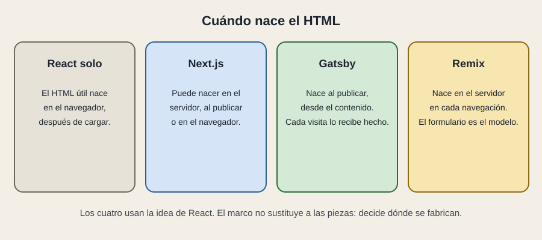

# Cuándo nace el HTML

[← Página anterior](README.md) · [Siguiente página →](02-next-gatsby-remix.md)

La persona ve una página. Esa página ha tenido que fabricarse en algún momento. El momento cambia el peso de la primera vista, lo que un buscador puede leer y lo que pasa cuando el dato cambia cada minuto.

## En el navegador, después de cargar

Es React solo, la SPA del primer módulo. Llega un armazón, el programa arranca y entonces pide los datos y describe la pantalla. La primera vista útil espera. Un buscador que no ejecuta ese programa ve poco. Para un panel interno, detrás de un inicio de sesión, a menudo da igual. Para una portada pública, duele.

## En el servidor, en cada visita o cada navegación

Alguien pide la dirección y el servidor compone el HTML con los datos de ese momento, lo envía, y React en el navegador toma el relevo para lo que sigue siendo interactivo. La primera lectura llega hecha. El dato puede ser fresco. El servidor trabaja en cada visita.

Remix apuesta por esto como manera principal: cada navegación es una pregunta al servidor, y el formulario es el gesto con el que los datos cambian. Next.js también sabe hacerlo.

## Al publicar

El HTML se fabrica cuando el equipo publica, a partir de contenido que en ese instante ya existe. Cada visita recibe una página hecha. Es rápido y barato de servir. El dato tiene la frescura de la última publicación. Gatsby es el nombre clásico de esta apuesta. Next.js también sabe hacerla, entera o por trozos.

## Por qué Next aparece en medio

Next.js no es un cuarto momento. Es un marco que sabe fabricar en el servidor, al publicar y en el navegador, incluso mezclando trozos de la misma pantalla. Esa flexibilidad es la razón de que sea el marco que más verás junto a React. También es la razón de que «usamos Next» no baste: hay que preguntar qué partes nacen en cada momento.

## Qué preguntar

- La primera vez que se abre la dirección, ¿el contenido ya viene en el HTML?
- Si el dato cambia ahora mismo, ¿la página se entera sin una nueva publicación?
- ¿Qué tiene que leer un buscador, y qué está detrás de un inicio de sesión?
