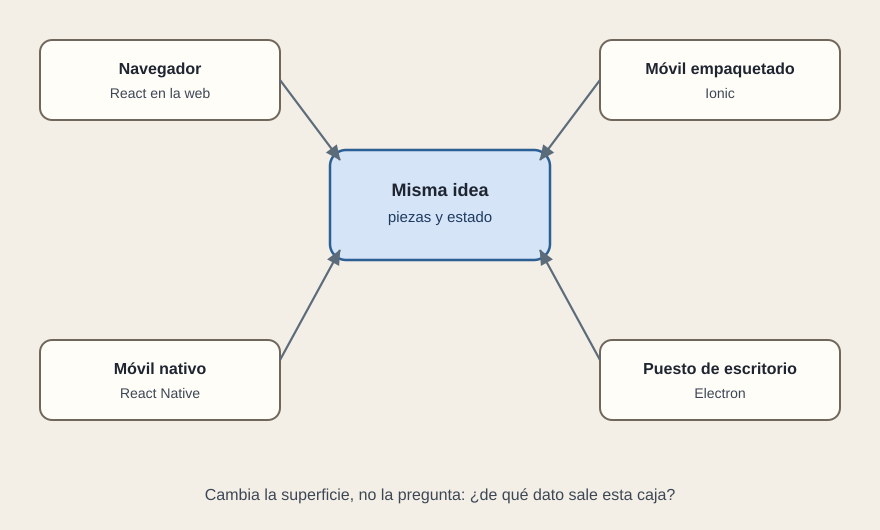

# La misma idea, otra superficie

[← Página anterior](README.md) · [Siguiente página →](02-ionic-native-electron.md)

Hasta aquí la persona estaba en un navegador. Muchas propuestas dan el siguiente paso con una frase: «y también la app». Debajo de esa frase hay tres productos distintos, y los tres pueden decir que usan React.

Lo que se conserva es la pregunta del boceto. ¿De qué dato sale esta caja? ¿Qué se recuerda? ¿Qué llega por la API y qué llega en vivo? Un equipo que ya piensa así reaprovecha criterio, y a veces lógica de datos, al cambiar de superficie.

Lo que no se conserva es la caja física. Un `div` del navegador no es un botón de Android ni una ventana de Windows. El estilo CSS no viaja entero a una app nativa. El taller de construcción echa un binario en una tienda, o un instalable, además de los archivos de la web. Y la promesa comercial tiene que coincidir con la superficie: «se siente como parte del teléfono» y «es nuestra web dentro de un marco» no cuestan lo mismo ni se revisan igual.

Híbrido, en este recorrido, quiere decir eso: la interfaz se describe con la idea de React y se entrega en un dispositivo que no es solo una pestaña. No quiere decir que una sola base sirva para todo sin coste.

## Qué preguntar

- ¿Dónde está la persona cuando hace la tarea: en un navegador, en un teléfono cerrado, en un puesto fijo?
- ¿Qué promesa se está haciendo: la web, una app de tienda, o un programa de escritorio?
- ¿El equipo reaprovecha el criterio de piezas, o espera reaprovechar la pantalla tal cual?
