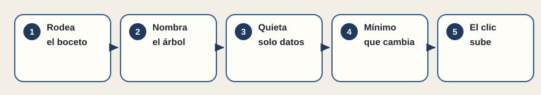
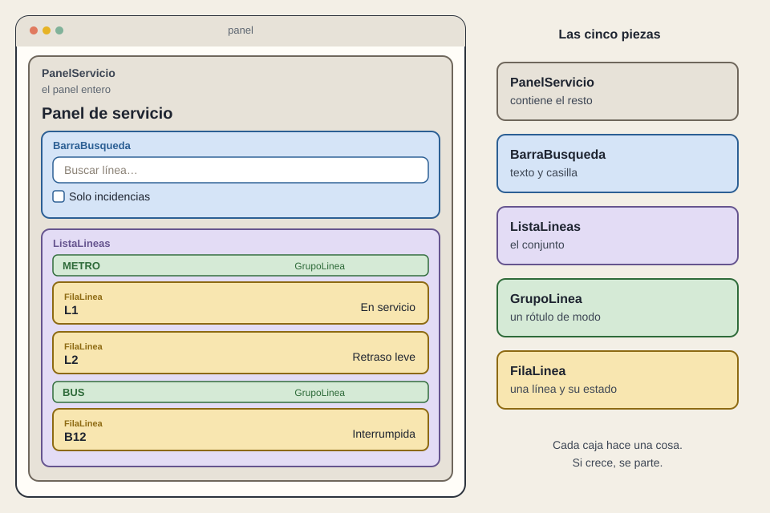

# El panel, de principio a fin

[← Página anterior](README.md) · [Siguiente página →](02-alarma-en-vivo.md)

Vuelve el boceto del panel de servicio. Esta vez se recorre del tirón, con los cinco pasos de [Pensar en React](https://es.react.dev/learn/thinking-in-react). Es el caso que concentra el curso: si este se sabe contar, el resto son variantes.

## 1. Rodea el boceto

Ahí están la búsqueda, la casilla, los rótulos Metro y Bus, y una fila por línea. Cinco piezas, no quince. El título se queda en el panel. La fila es una, aunque se vea tres veces.

## 2. Nombra el árbol

`PanelServicio` contiene `BarraBusqueda` y `ListaLineas`. La lista contiene `GrupoLinea` y `FilaLinea`. Los datos tenían la misma forma: modo y, dentro, líneas. Cuando el árbol y los datos se parecen, la pantalla suele estar bien partida. Cuando no se parecen, o el JSON está torcido o el dibujo mezcla dos trabajos.

## 3. Imagina la pantalla quieta

Sin búsqueda y sin casilla, las tres líneas se ven. Todo llega por props. `FilaLinea` recibe nombre y estado. No hay recuerdo todavía. Esta es la versión que una demo enseña siempre, y es solo el suelo.

## 4. Quédate con el mínimo que cambia

Se recuerda el texto y la casilla. La lista filtrada se calcula. Si además se abre un detalle, se recuerda qué línea está elegida —mejor en la dirección, para poder enviar el enlace—. No se recuerda un segundo array de «líneas visibles» ni un contador de incidencias: ambos se pueden derivar y, si se guardan, mienten.

## 5. Sube el clic

Escribir llama a quien guarda el texto. Marcar la casilla llama a quien guarda la casilla. Pulsar una fila dice «L2» y quien guarda la selección describe el detalle. La fila sigue sin saber de rutas.

A partir de aquí el caso se abre a lo que el panel, en una empresa, todavía no enseña. Las líneas dejarán de vivir al lado del dibujo y vendrán de una API: harán falta los cuatro finales. Si el estado operativo cambia solo, hará falta una vía en vivo, que es el caso siguiente. Si la primera vista debe poder compartirse fuera, hará falta decidir cuándo nace el HTML. Si quien consulta está en vía y no en una mesa, hará falta elegir superficie.

El panel pequeño ya permite rechazar una entrega que solo tiene el caso feliz, una fila copiada tres veces, o un contador guardado a mano.

## Qué preguntar al terminar el caso

- ¿Cuáles son las cinco piezas, de memoria?
- ¿Qué dos cosas se recuerdan, y qué se calcula?
- ¿Dónde sube el clic de la fila?
