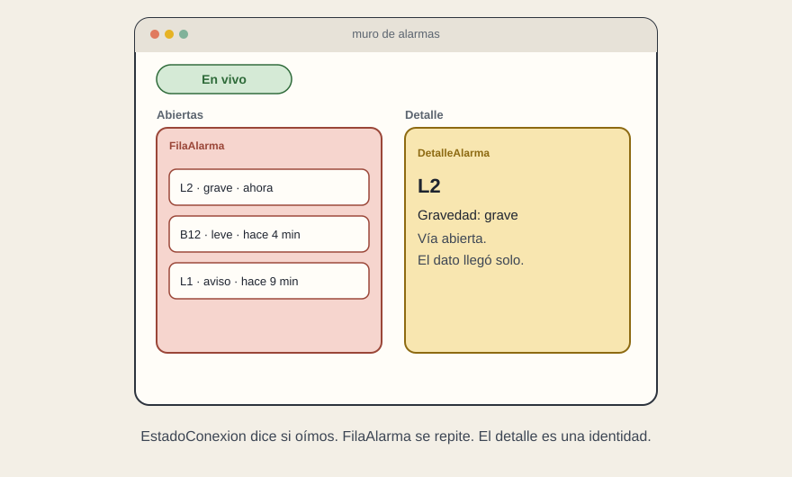

# Una alarma que llega sola

[← Página anterior](01-panel-de-servicio.md) · [Siguiente página →](03-leer-una-propuesta.md)

El segundo caso añade tiempo. Una alarma no espera a que la persona pulse «buscar». Llega, ocupa una fila, y más tarde se va porque alguien la cierra o porque el origen la cancela.

## El boceto, en cuatro cajas

Un muro con tres zonas: las alarmas abiertas, el detalle de la que está seleccionada, y un letrero discreto de la conexión («en vivo» / «sin conexión»). No hace falta más para empezar.

La pieza que se repite es `FilaAlarma`. Recibe gravedad, hora, línea afectada y una frase. `MuroAlarmas` decide el orden —las graves arriba, o las más nuevas— y no deja que la fila lo decida. `DetalleAlarma` pinta la ficha de una identidad. `EstadoConexion` pinta la vía, no el negocio.

## Qué es estado y qué es un mensaje

Cada alarma es un dato que entra. El conjunto abierto es el recuerdo del muro. El mensaje que llega no se guarda además en otro sitio: o entra en el conjunto o, si ya existía, lo actualiza. Dos listas —«las de la API» y «las del socket»— son la alerta de las dos verdades.

La línea abierta es un WebSocket, o un equivalente. Al aparecer el muro, se abre. Al irse, se cierra. Esa es la visita de la pieza, dicha en una frase. Si nadie sabe decir cuándo se cierra, la sala de control seguirá escuchando después de haber cambiado de pantalla.

## Los finales, traducidos

Cargando: todavía no sabemos si la vía está abierta, y aún no ha llegado el primer lote. Con datos: hay al menos una alarma. Vacío: la vía está bien y no hay alarmas. Esa frase tranquiliza. Error o silencio enfermo: la vía cayó, o hace demasiado que no llega ni un latido. Un muro en blanco no distingue el vacío del fallo, y en una alarma esa distinción es el producto.

El panel de servicio del caso anterior puede convivir con este. Son dos bocetos. Comparten `FilaLinea` solo si la fila de verdad es la misma. Si la alarma tiene gravedad, hora y acuse de recibo, forzarle la pieza de la línea es la copia al revés: reutilizar de más también acopla.

## Superficie

En una mesa de operador, navegador o Electron si el puesto lo exige. En un teléfono de quien está fuera, Ionic o React Native según el oficio que se haya prometido. El muro no elige la superficie. El lugar de la persona la elige. El contrato del mensaje es el mismo en las dos.

## Qué preguntar

- ¿Cómo se distingue «no hay alarmas» de «no estamos oyendo»?
- ¿La escucha se cierra al salir de la pantalla?
- ¿La alarma nueva actualiza la que ya estaba, o convive con una copia?
